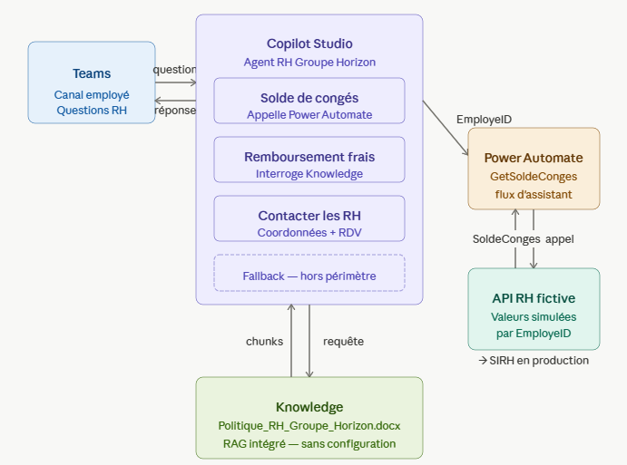

# POC 2 — Agent RH conversationnel Copilot Studio

Agent conversationnel low-code développé avec Microsoft Copilot Studio 
et Power Automate, permettant aux employés d'interroger en langage naturel 
la politique RH du Groupe Horizon directement depuis Microsoft Teams.

## Différences avec le POC 1

| | POC 1 — Agent documentaire SharePoint | POC 2 — Agent RH Copilot Studio |
|---|---|---|
| Approche | Pro-code (Python) | Low-code (no-code) |
| Orchestration | Semantic Kernel | Copilot Studio |
| Intégration | Azure AI Search | Power Automate + Knowledge |
| Interface | Ligne de commande | Microsoft Teams |
| Cible | Développeurs | Équipes métier |

## Stack technique

- Microsoft Copilot Studio (topics, Knowledge, flux d'assistant intégré)
- Microsoft 365 (Teams, SharePoint)

## Cas d'usage démontrés

✅ Solde de congés personnalisé par employé (via un flux d'assistant intégré)  
✅ Politique de remboursement des frais (via Knowledge documentaire)  
✅ Redirection vers l'interlocuteur RH approprié selon le motif  
✅ Gestion des questions hors périmètre (Fallback propre)

## Architecture

## Démonstration

[Démonstration POC](https://youtu.be/5ePrSpL5EEA)

## Document

- `docs/Politique_RH_Groupe_Horizon.docx` — document de politique RH 
  utilisé comme source Knowledge

## Déploiement

L'agent est déployable sur Microsoft Teams, Web Chat et d'autres canaux 
via la section Canaux de Copilot Studio avec une licence appropriée.